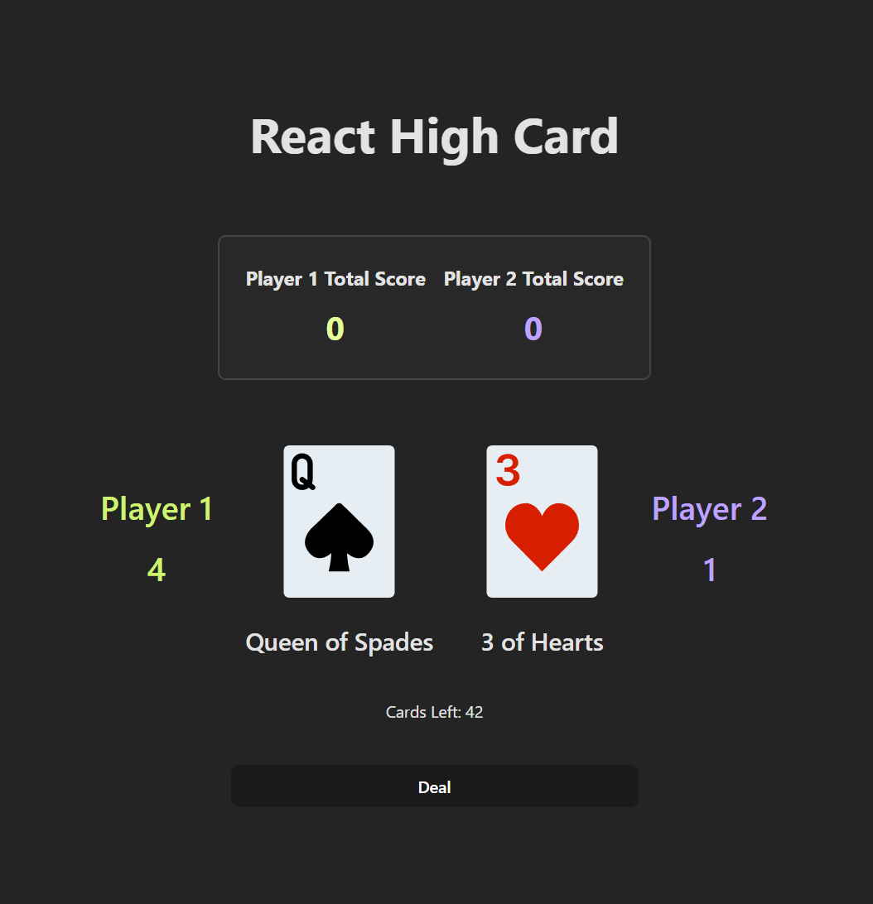
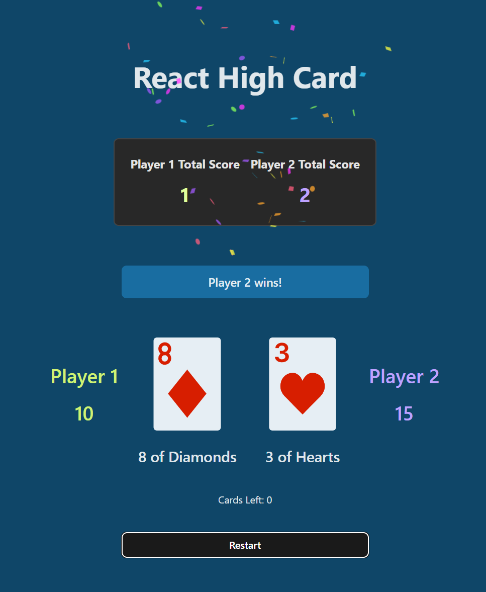

# High Card
Try the High Card game here: https://lamefreak.github.io/high-card-3.2/




## Getting Started
Fork and clone the repo to your local machine.
```
git clone https://github.com/LAMEfreak/high-card-3.2.git
```
This project was created using with Vitejs. In the project directory, please run the following commands:

`npm install`

`npm run dev`

The second command will run the app
To see the rendered output please open http://localhost:5173 in the browser of your choice, EG: Google Chrome.

The page will reload when you make changes.
You may also see any lint errors in the console.

## Instructions
- Deal 1 card to each player using the "Deal" button. The player with the higher card wins and scores a point for the round.
- No points are awarded if it is a draw.
- When all 52 cards in the deck have been drawn, the total points are tallied and the player with the higher number of points wins the game and scores 1 game point.
- No game points are awarded if it is a draw.
- Check the scoreboard to track the number of games each player has won.

## Technologies Used
- React
- HTML / CSS / JavaScript
- canvas-confetti library by catdad
